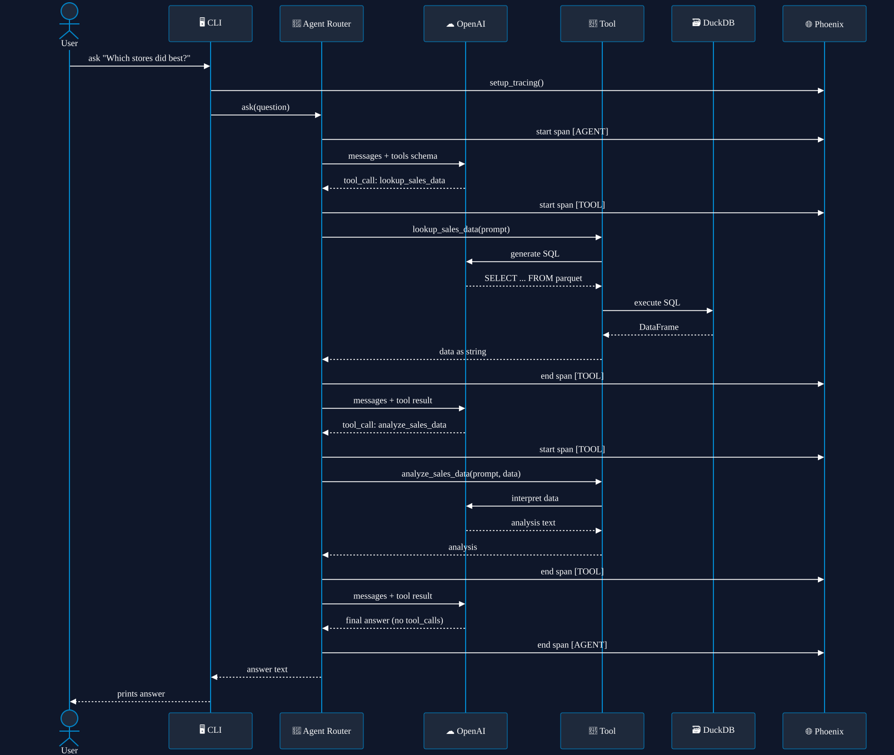
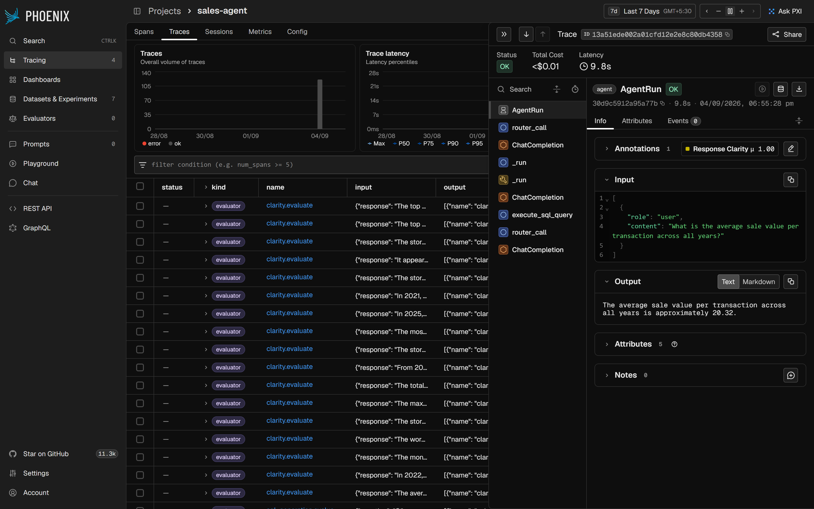

# sales-agent-evals

> An observable, evaluated OpenAI function-calling agent over a 1.48M-row
> store-sales dataset — traced end-to-end in Arize Phoenix and scored by
> LLM-as-judge and code evaluators.


Ask a natural-language question and the agent's router picks tools — a DuckDB
SQL lookup, an LLM analysis step, and a matplotlib chart generator — runs them,
and returns an answer. Every step emits an OpenTelemetry span to
[Arize Phoenix](https://github.com/Arize-ai/phoenix), and a suite of evaluators
then queries those spans and scores them.

## What it demonstrates

- **Agent orchestration** — an OpenAI function-calling router loop that chains
  tools until it can answer, with no hard-coded flow.
- **LLM observability** — full OpenTelemetry tracing (`agent → router_call →
  tool → chain`) auto-instrumented and replayable in the Phoenix UI.
- **Evaluation** — three LLM-as-judge evaluators (tool choice, SQL, clarity)
  and one deterministic code evaluator (does generated chart code run?), with
  scores written back to the traced spans as annotations.
- **A convergence experiment** — 17 paraphrases of one question, scored on how
  directly each reaches the answer.
- **Reproducible data** — a seeded generator produces the 1.48M-row dataset
  spanning 2021–2026, so it can be regenerated or extended on demand.

## Architecture

| Module | Role |
|--------|------|
| `config.py` | Env-driven settings; builds the OpenAI client from `OPENAI_BASE_URL` / `OPENAI_API_KEY` / `OPENAI_MODEL` |
| `tracing.py` | Phoenix setup via `register(auto_instrument=True)`, with a `launch_app()` fallback and a no-op tracer default for tests |
| `tools.py` | The three tools (`lookup_sales_data`, `analyze_sales_data`, `generate_visualization`) + their OpenAI schema |
| `agent.py` | The instrumented router loop |
| `evals.py` | LLM-judge and code evaluators over traced spans |
| `experiments.py` | The convergence experiment |
| `cli.py` | `sales-agent ask \| eval \| experiment` |
| `scripts/generate_data.py` | Seeded, idempotent dataset generator |

## Request flow

A single `ask` call: question in, answer out, every step traced.



## Observability & eval pipeline

Spans collected in Phoenix → four evaluators score them → scores written back
as annotations → a convergence experiment measures consistency across
paraphrases.



## Setup

```bash
uv sync                 # creates .venv and installs the project + all dependencies
uv sync --extra dev     # also installs pytest, for running the tests
cp .env.example .env     # then fill in OPENAI_API_KEY (and optionally OPENAI_BASE_URL, OPENAI_MODEL)
```

The agent talks to **any** OpenAI-compatible endpoint. Set `OPENAI_BASE_URL`,
`OPENAI_API_KEY`, and `OPENAI_MODEL` in your local `.env` (git-ignored). The
code reads these blindly — it has no knowledge of any specific provider.

## Usage

```bash
uv run python -m sales_agent.cli ask "Which stores are having the strongest sales so far in 2026?"
uv run python -m sales_agent.cli eval            # run all evaluators over traced spans
uv run python -m sales_agent.cli eval sql        # or just one: tool-calling | sql | clarity | code
uv run python -m sales_agent.cli experiment      # run the convergence experiment
```

Example:

```console
$ uv run python -m sales_agent.cli ask "How have total sales changed year over year from 2022 to 2025?"
From 2022 to 2023, total sales increased by approximately 2.27%. From 2023 to
2024, total sales increased significantly by about 14.60%. From 2024 to 2025,
total sales continued to rise by approximately 13.18%.
```

### Traces in Phoenix

Open `http://localhost:6006` after a run to see the full trace — the
`AgentRun → router_call → execute_sql_query` waterfall, with inputs, outputs,
token counts, and latency on every span.

If no Phoenix collector is running at `PHOENIX_COLLECTOR_ENDPOINT`, the agent
launches one in-process automatically, so tracing works with no extra setup.



## Dataset

A single Parquet file under `data/`: ~1.48M rows of store-sales, price, and
promotion data spanning **2021-11-01 → 2026-09-04** across 35 stores. It's
committed to the repo, so nothing needs downloading to run the examples.

To regenerate or extend it, use the generator:

```bash
uv run python scripts/generate_data.py                    # extend to 2026-09-04
uv run python scripts/generate_data.py --until 2025-12-31 --seed 7
```

It learns the store / SKU / price / promo structure from the existing rows and
appends seeded rows for dates after the current maximum. The `--seed` makes the
output deterministic, and it only adds new dates, so re-running never
duplicates data.

## Tests

```bash
uv run python -m pytest
```

The suite (10 tests) runs **without an API key**: it covers config loading, the
no-op tracer, real DuckDB SQL execution, the runnable-code check, and CLI
parsing. The LLM-judge evaluators and the router loop are integration-only
(they need a key and a live Phoenix) and are intentionally not part of the
no-key suite.

## License

MIT — see [LICENSE](LICENSE).
